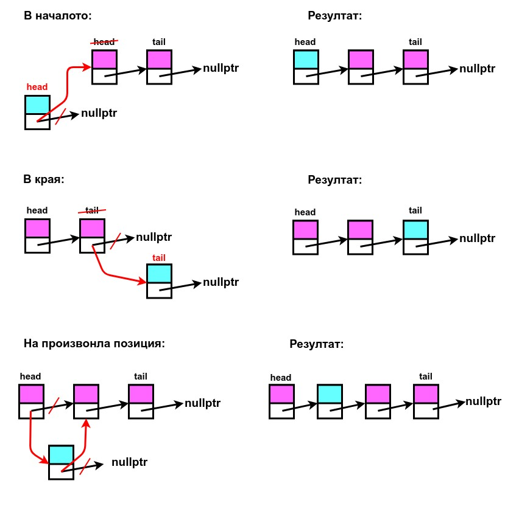
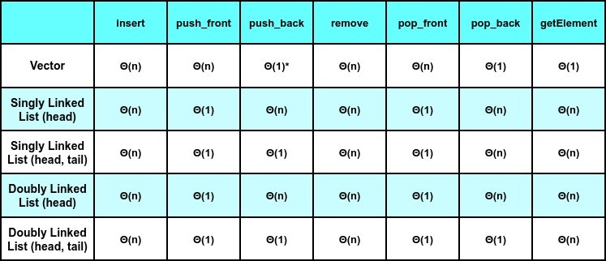

# Практикум 4: Свързани списъци

Има два вида свързан списък:
- **Едносвързан списък ( *Singly Linked List* ):** възелчетата имат само един указател, който е насочен към следващия възел ( *next* ).

- **Двусвързан списък ( *Doubly Linked List* ):** възелчетата имат два указателя - към предходния възел ( *prev* ) и към следващия възел ( *next* ). 

#### ❕**ЗАБЕЛЕЖКА**❕
> - **head** - указател към първия възел в списъка ( *началото* )
> - **tail** - указател към последния възел в списъка ( *края* )

## Операции със свързан списък:
Приемаме, че работим с едносвързан списък, поддържащ указател към началото на списъка ( *head* ), както и указател към края на списъка ( *tail* ).
- **Добавяне на елемент:**  

  
- **Изтриване на елемент:**

- **Достъпване на елемент:** 

  *//to do...*
   

### ⚠️ **Какво е предимството на свързания списък пред останалите структури от данни?**
Поддържа константна сложност [ **Θ(1)** ] при конкатенация на два свързани списъка, но това е в случаите, когато имплементацията на списъка е с указатели към първия възел ( *head* ) и последния възел ( *tail* ).

## Сложности:

## Задачи:
- [Линк към задачите](https://leetcode.com/problem-list/awvsv662/)
- [Линк към допълнителни задачи](https://docs.google.com/document/d/1WMc5IfCP_wrf2DygAh5GS3AvpzP-2A1LNtcOg__Gsgg/edit?tab=t.0)
