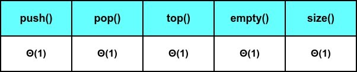
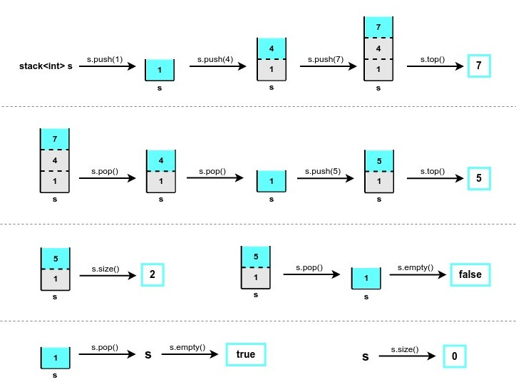
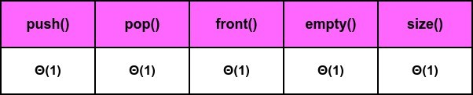
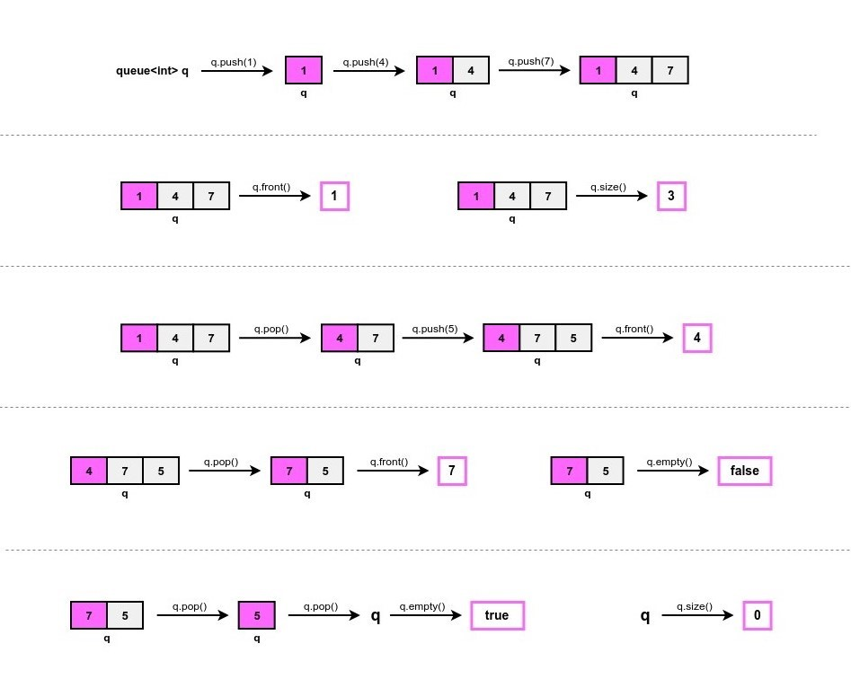

# Практикум 5: Стек и Опашка

## Стек (Stack) - LIFO (Last In First Out)
Стекът представлява абстрактна структура от данни, при която **нямаме** *random access* - **имаме достъп само до върха на стека.**

### Операции:
- **push(value)** - добавя елемент със стойност *value* в стека
- **pop()** - премахва елемента, който се намира на върха на стека
- **top()** - връща елемента, който се намира на върха на стека
- **empty()** - проверява дали стекът е празен
- **size()** - връща броя на елементите в стека

### Сложности по време на операциите:

### Пример за работа със стек:

 

## Опашка (Queue) - FIFO (First In First Out)
Опашката е абстрактна структура от данни, при която, също като при стека, **нямаме** *random access* - **имаме достъп само до елемента, намиращ се в началото на опашката.**

### Операции:
- **push(value)** - добавя елемент със стойност *value* в края на опашката
- **pop()** - премахва елемента, който се намира в началото на опашката
- **front()** - връща елемента, който се намира в началото на опашката
- **empty()** - проверява дали опашката е празна
- **size()** - връща броя на елементите в опашката

### Сложности по време на операциите:

### Пример за работа с опашка:

