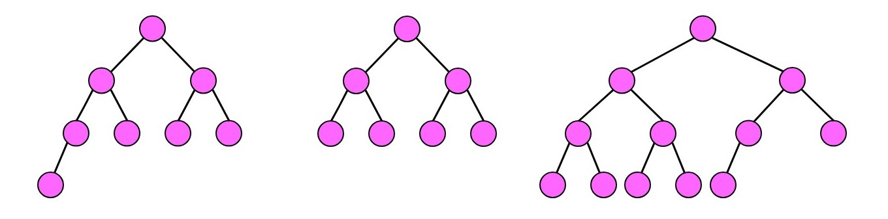
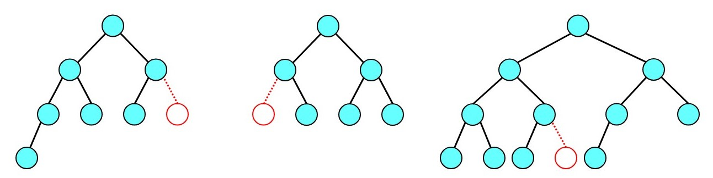
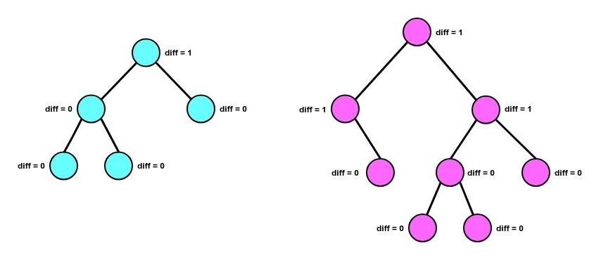
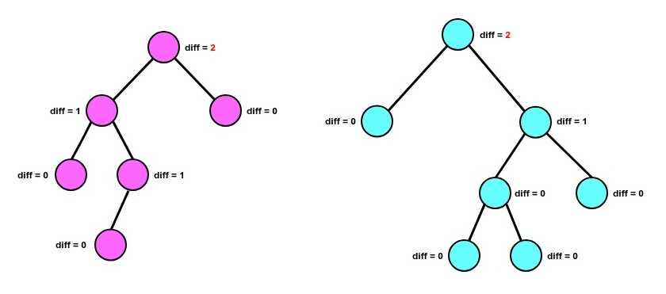
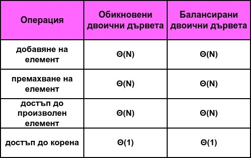

# Практикум 6: Двоични дървета

### Дефиниция за двоично дърво:
Kореново дърво, в което всеки връх има най-много два наследника ( *ляв и десен* ).

## Двоично пълно дърво (Binary Complete Tree)
Всичките му нива са запълнени освен евентуално последното.
Ако последното не е запълнено, то врърховете се намират максимално на ляво.

### Примери за двоични дървета, които са пълни:

### Примери за двоични дървета, които НЕ са пълни:

#### ❕**ЗАБЕЛЕЖКА**❕
> Възелчетата, оцветени в червено, са липсващи и затова дърветата не са пълни.

## Двоично балансирано дърво (Binary Balanced Tree)
Казваме, че дадено кореново двоично дърво е балансирано, ако за всеки негов връх е изпълнено:
**абсолютната разлика на височината в лявото му поддърво и височината в дясното му поддърво е по-малка или
равна на 1**.

### Примери за балансирани дървета:

### Примери за небалансирани дървета:

#### ❕**ВАЖНО**❕
> Всяко двоично пълно дърво е балансирано.

## Двоично дърво за търсене (Binary Search Tree)
- [Линк към темата за двоично наредено дърво](../Pract%2007/README.md)

## Сложности (Complexity)

## Задачи:
- [Линк към задачите](https://leetcode.com/problem-list/aw7610t5/)
- [Линк към допълнителни задачи](https://docs.google.com/document/d/1DfhSo_0DK3zsLCB0sdveLOHUcrneMYfx9Z_uVUCDkkk/edit?tab=t.0)