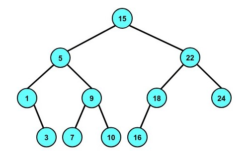

# Практикум 7: Двоично наредено дърво за търсене
BST е кореново двоично дърво, за всеки връх на което са изпълнени следните правила:
- ако има ляв наследник, то той е с по-малка стойност
- ако има десен наследник, то той е с по-голяма стойност

## Видове обхождания в BST
- **pre****order traversal** : **корен**-ляво-дясно  &nbsp;**||**&nbsp; **корен**-дясно-ляво
- **in****order traversal** : ляво-**корен**-дясно &nbsp;**||**&nbsp; дясно-**корен**-ляво
- **post****order traversal** : ляво-дясно-**корен** &nbsp;**||**&nbsp; дясно-ляво-**корен**

#### ❕**ВАЖНО**❕
> Каквато е представката, такава е и позицията на корена при обхождането

### Имплементации:
- [Preorder Traversal](preorderTraversal.cpp)
- [Inorder Traversal](inorderTraversal.cpp)
- [Postorder Traversal](postorderTraversal.cpp)

Нека използваме тези имплементации върху двоичното наредено дърво за търсене от примера по-горе, а именно:

Какво очакваме да се отпечата на конзолата при различните обхождания?
- При **pre****order обхождане** :&nbsp;  15&nbsp;  5&nbsp;  1&nbsp;  3&nbsp;  9&nbsp;  7&nbsp;  10&nbsp;  22&nbsp;  18&nbsp;  16&nbsp;  24&nbsp; 

- При **in****order обхождане** :&nbsp;  1&nbsp;  3&nbsp;  5&nbsp;  7&nbsp;  9&nbsp;  10&nbsp;  15&nbsp;  16&nbsp;  18&nbsp;  22&nbsp;  24&nbsp; 

- При **post****order обхождане** :&nbsp; 3&nbsp;  1&nbsp;  7&nbsp;  10&nbsp;  9&nbsp;  5&nbsp;  16&nbsp;  18&nbsp;  24&nbsp;  22&nbsp;  15&nbsp;  

#### ❕**ВАЖНО**❕
> Когато обхождаме двоично наредено дърво **in****order**, ние всъщност обхождаме възелите му в **сортиран ред**. 
> - Ако обхождането е **ляво-****корен****-дясно**, то обхождаме дървото във **възходящ ред**.
> - Ако обхождането е **дясно-****корен****-ляво**, то обхождането е в **низходящ ред**.

## Сложности:
// to do...

## Задачи:
- [Линк към задачите](https://leetcode.com/problem-list/ak9s8zte/)
- [Линк към допълнителни задачи]()