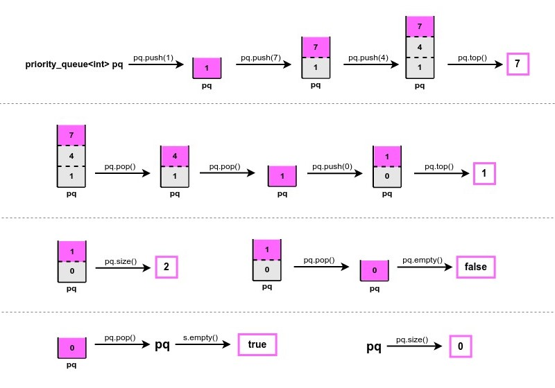
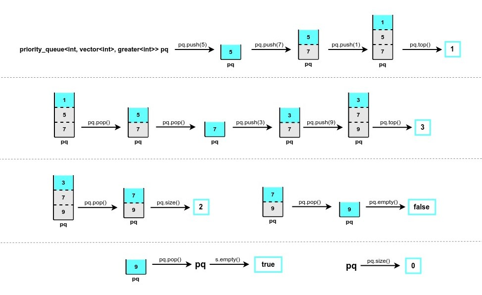

# Практикум 8: Приоритетна опашка

Приоритетната опашка ( *Priority queue* ) е Абстрактна Структура от Данни (АДТ), която 
наподобява нормалната опашка ( *Queue* ), с разликата, че всеки елемент си има приоритет.

### Пример за максимална приоритетна опашка ( *Max Heap* ):


### Пример за минимална приоритетна опашка ( *Min Heap* ):


#### ❕**ВАЖНО**❕
Типът на елементите в приоритетната опашка трябва да има дефинирана някаква наредба - тоест да има дефиниран оператор **<** или оператор **( )**. Вградените типове ( *int, char, string и т.н.* ) имат дефиниран оператор **<**, следователно можем да ги използваме директно. Но когато се наложи да използваме *custom-made* тип или искаме някаква специфична наредба, то тогава е необходимо да пренапишем оператор **<** или оператор **( )**.

### Примерна задача:
Даден е масив от цели числа и цяло число к.
Да се върнат к-те най-често срещани елементи в масива.

Пример 1: </br>
Input: nums = [1,1,1,2,2,3], k = 2 </br>
Output: [1,2] </br></br>
Пример 2: </br>
Input: nums = [1], k = 1 </br>
Output: [1]

Решение:

```c++

class Solution {
    
public:
    vector<int> topKFrequent(vector<int>& nums, int k) {

    }
};
```

Първо, трябва да обходим масива и да преброим всеки елемент колко пъти се среща.
За целта ще изпозлваме *map* с ключ дадено число и стойност - колко пъти се среща това число.

```c++
class Solution {
    
public:
    vector<int> topKFrequent(vector<int>& nums, int k) {
        map<int, int> freq; // number : freq

        for(int i = 0; i < nums.size(); i++)
        {
            if(freq.find(nums[i]) != freq.end())
            {
                freq[nums[i]]++;
            }
            else
            {
                freq.insert({nums[i], 1});
            }
        }
    }      
};
```

След като вече сме намерили различните числа и сме преброили колко пъти се срещат, 
ще създадем priority_queue, в което ще поставим наредените двойки {число : брой срещания} и ще ги сортираме по втория елемент, а именно броя срещания. За целта, ще дефинираме оператор ():

```c++
class Compare
{
public:
    bool operator()(const pair<int, int>& a, const pair<int, int>& b)
    {
        return a.second < b.second;
    }
};

class Solution {
    
public:
    vector<int> topKFrequent(vector<int>& nums, int k) {
        map<int, int> freq; // number : freq

        for(int i = 0; i < nums.size(); i++)
        {
            if(freq.find(nums[i]) != freq.end())
            {
                freq[nums[i]]++;
            }
            else
            {
                freq.insert({nums[i], 1});
            }
        }

        priority_queue<pair<int, int>, vector<pair<int, int>>, Compare> pq;

        for(auto iter = freq.begin(); iter != freq.end(); iter++)
        {
            pq.push({iter->first, iter->second});
        }
    }
};
```
След като вече имаме наредените двойки {число : брой срещания}, остава да вземем к-те най-често срещани числа. Следователно, трябва да вземем първите к елемента на приоритетната опашка:
```c++
class Compare
{
public:
    bool operator()(const pair<int, int>& a, const pair<int, int>& b)
    {
        return a.second < b.second;
    }
};

class Solution {
    
public:
    vector<int> topKFrequent(vector<int>& nums, int k) {
        map<int, int> freq; // number : freq

        for(int i = 0; i < nums.size(); i++)
        {
            if(freq.find(nums[i]) != freq.end())
            {
                freq[nums[i]]++;
            }
            else
            {
                freq.insert({nums[i], 1});
            }
        }

        priority_queue<pair<int, int>, vector<pair<int, int>>, Compare> pq;

        for(auto iter = freq.begin(); iter != freq.end(); iter++)
        {
            pq.push({iter->first, iter->second});
        }

        int index = 0;
        vector<int> result(k);
        while(k > 0)
        {
            result[index++] = pq.top().first;
            pq.pop();
            k--;
        }

        return result;
    }
};
```

- [Линк към задачата в LeetCode](https://leetcode.com/problems/top-k-frequent-elements/description/)

### Сложности:
//To do...

## Задачи:
- [Линк към задачите](https://leetcode.com/problem-list/agz3w971/)
- [Линк към допълнителни задачи](https://leetcode.com/problem-list/a4i937t6/)