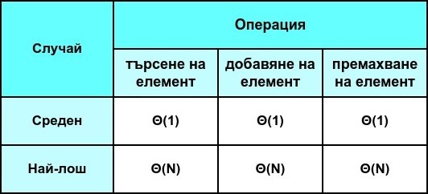

# Практикум 9: Хеш таблици

Структурите **unordered_set** и **unordered_map** използват хеширане, благодарение на което осигуряват бърз достъп до данните, както и лесно добавяне и търсене на елементи.

## unordered_set
Множество от уникални елементи, които са съхранявани в произволен ред.

```c++
#include <iostream>
#include <unordered_set> // !!!

int main()
{
    std::unordered_set<int> temp = {11, 21, 22, 29};

    // Проверка дали елемент се съдържа в unordered_set структурата
    if (temp.find(30) != temp.end()) 
    {
        std::cout << "30 се съдържа в множeството" << std::endl;
    }
    else
    {
        temp.insert(30); // Добавяне на елемент в unordered_set структурата
    }

    // Премахване на елемент от unordered_set структурата
    temp.erase(11);

    // Итериране през елементите на unordered_set структурата
    for (auto iter = temp.begin(); iter != temp.end(); iter++) 
    {
        std::cout << (*iter) << " ";
    }
    std::cout << endl;

    return 0;
}
```

</br>

## unordered_map
Множество от двойки във вида - { *ключ : стойност* }. Използва се за бързо намиране на стойност по даден ключ.

### Примерна задача:
Даден е масив от цели числа и цяло число к.
Да се върнат к-те най-често срещани елементи в масива.

#### Пример 1: </br>
**Input:** nums = [1,1,1,2,2,3], k = 2 </br>
**Output:** [1,2] </br>
#### Пример 2: </br>
**Input:** nums = [1], k = 1 </br>
**Output:** [1]

#### **Решение:**

```c++
class Solution {    
public:
    vector<int> topKFrequent(vector<int>& nums, int k) {
        unordered_map<int, int> freq; // число : брой срещания

        // Итерираме през масива от цели числа и ако текущото число не се среща в unordered_map-а, то го добавяме със стойност за броя на срещанията -> 1, а ако вече сме го дабвили в unordered_map-а, то просто увеличаваме броя на срещанията му с 1.
        for(int i = 0; i < nums.size(); i++)
        {
            if(freq.find(nums[i]) != freq.end())
            {
                freq[nums[i]]++;
            }
            else
            {
                freq.insert({nums[i], 1});
            }
        }

        priority_queue<pair<int, int>> pq;

        // Итерираме през двойките { число : брой срещания} и ги добавяме в приоритетната опашка в обратен вид, т.е. { брой срещания : число }, за да може числата с най-голям брой срещания да изплуват на върха на приоритетната опашка.
        for(auto iter = freq.begin(); iter != freq.end(); iter++)
        {
            pq.push({iter->second, iter->first});
        }

        int index = 0;
        vector<int> result(k);
        while(k > 0)
        {
            result[index++] = pq.top().second;
            pq.pop();
            k--;
        }

        return result;
    }
};
```
- [Линк към задачата](https://leetcode.com/problems/top-k-frequent-elements/description/)

</br>

#### ❕**ВАЖНО**❕
> Функционалностите на структурите **unordered_set** и **unordered_map** са подобни на тези, предоставяни от структурите **set** и **map**, но има няколко важни разлики, които все пак ги разграничават едни от други.

## set/map vs. unordered_set/unordered_map:
- **set** и **map** съхраняват елементите в сортиран ред, докато **unordered_set** и **unordered_map** съхраняват елементите в произволен ред </br></br>
- **set** и **map** използват балансирани дървета, а **unordered_set** и **unordered_map** използват хеш таблици </br></br>
- търсенето на елемент в set и map е със сложност Θ(log(N)), докато при unordered_set и unordered_map в повечето случаи е със сложност Θ(1)

</br>

## Сложности:


## Задачи:
- [Линк към задачите](https://leetcode.com/problem-list/aslfprpj/)
- [Линк към допълнителни задачи](https://leetcode.com/problem-list/a19800zg/)