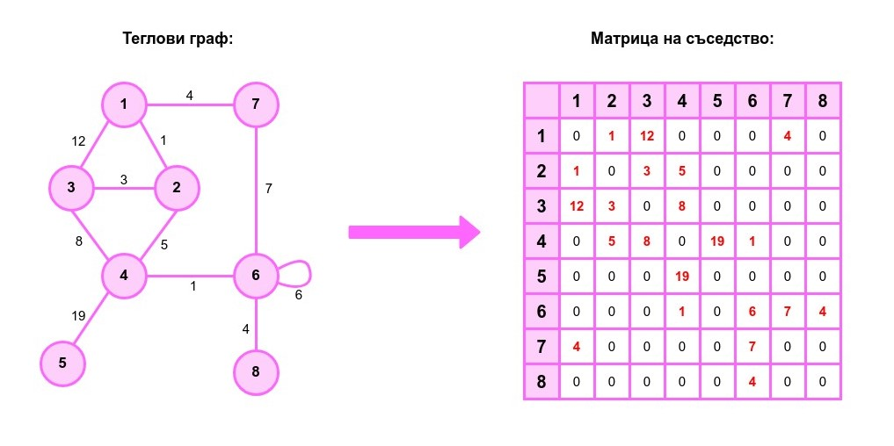

# Практикум 11: Графи
Нека е даден граф G(V, E), където:

**V** - множество на върховете в графа </br>
**| V | = N** - броят на върховете в графа е равен N</br>
**E** - множество на ребрата в графа </br>
**| E | = M** - броят на ребрата в графа е равен М </br>


## Представяне на графи

### Чрез матрица на съседство
Нека  **Adj** е матрица на съседство на графа **G**, a  Ако **u** и **v** са върхове от множеството **V** ( *u, v ∈ V* ). Тогава:
- ако между върховете **u** и **v**  няма ребро, то **Adj[u][v] = 0**
- ако между върховете **u** и **v**  има ребро, то ако графът е нетеглови - **Adj[u][v] = 1**, а ако е теглови - **Adj[u][v] != 0**

#### Пример:


#### Предимства:
- константна проверка дали има ребро между 2 върха  ( ***Θ(1)*** )
- позволява ни за константно време  ( ***Θ(1)*** ) да добавяме и трием ребра ( *в частност, ако графът е теглови - да се обновява цената на ребрата* )

#### Недостатъци:
  - използваме голямо количество памет
  - ако искаме да обходим съседите на даден връх **u**, то трябва да обходим всички върхове от множеството **V**
  
  </br>

### Чрез списък на съседство
За всеки връх **v** създаваме **vector**, пазещ кои са съседит му. Тоест представянето на графа изглежда така: </br>
    
```c++
vector<vector<int>> adjList(N);
```

#### Пример:


#### Предимства:
- обхожданията ( *BFS, DFS* ) работят по-бързо с представянето на графа чрез списък на съседство в сравнение с матрицата на съседство
- за връх **u ∈ V** , ако **d = adjList[u].size()** ( *т.e. **d** е броя на съседите на връх **u*** ), то:
  - ако графът е неориентиран: **deg(u) = d**
  - ако графът е ориентиран: **deg_out(u) = d**
  
#### Недостатъци:
- проверката дали има ребро между 2 върха **u** и **v** ( *u, v ∈ V* ) е **Θ(adjList[u].size())**. 
- Модифицирането на графа, т.е. операциите по:
  - премахване на ребро между върховете **u** и **v** ( *сложността е **Θ(adjList[u].size())*** )
  - променяне на тегло на ребро между върховете **u** и **v** ( *сложността е **Θ( adjList[u].size())*** ) </br> налагат обхождането на всички съседи. Добавянето на ребро обаче си се запазва с константна сложност.

## Обхождане на графи

### Обхождане в широчина ( *BFS* ):
Обхождането в широчина се осъществява спрямо някакъв стартов връх ( *спрямо различните стартови върхове, редът, в който обхождаме графа, е различен* ).

> #### Алгоритъм:
> 1) Маркираме стартовия връх за посетен
> 2) Добавяме стартовия връх в опашката
> 3) Докато има върхове в опашката:
>    - взимаме върха, който е front() за опашката (нека го отбележим с node)
>    - премахваме го от опашката -> pop()
>    - обхождаме съседите на node и ако има непосетен съсед, добавяме го в опашката
>    - маркираме съседа за посетен
  
#### Сложност: **Θ(N + M)**

#### ❕**ВАЖНО**❕
> Минаваме през всеки връх точно веднъж и през всяко ребро точно веднъж.

### Обхождане в дълбочина ( *DFS* ):
Както при **BFS**, **DFS** започва от някакъв стартов връх ( *спрямо различните стартови върхове, редът на обхождане на върховете е различен* ).

> #### Алгоритъм:
> 1) Маркираме стартовия връх за посетен ( *ще го бележим с **node*** )
> 2) Обхождаме съседите на **node** и ако има непосетен съсед, повтаряме стъпка **1)** и **2)**, докато не достигнем до връх без непосетени съседи.

#### Сложност: **Θ(N + M)**

## Задачи:
- [Линк към задачите](https://leetcode.com/problem-list/awk2mqmm/)
- [Линк към допълнителни задачи](https://leetcode.com/problem-list/abh0ymm2/)