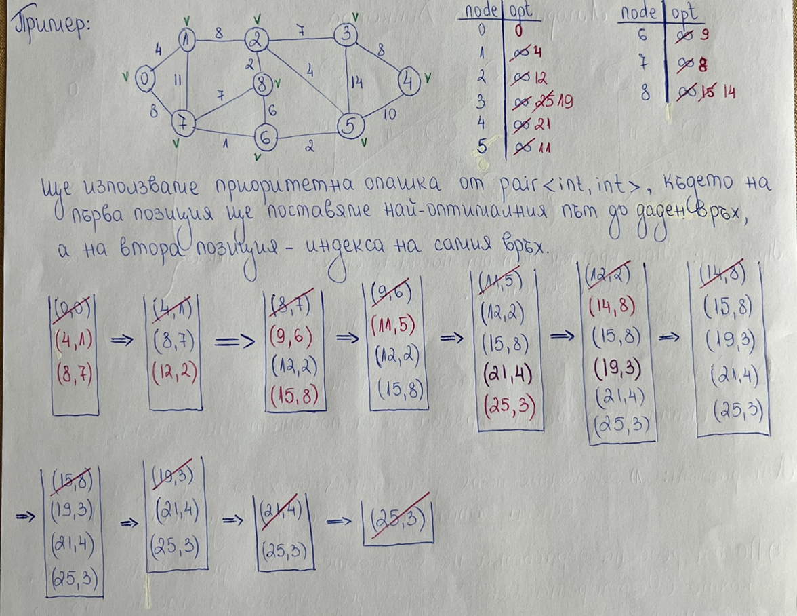

# Практикум 12: Алгоритъм на Дийкстра

#### ❕**ВАЖНО**❕
Утре ще бъдат качени задачите и решенията им от 2та допълнителни часа

- [Линк към темата за графи](../Pract%2011)

## Алгоритъм на Дийкстра

Алгоритъмът на Дийкстра намира най-краткия път от даден връх до всички останали ( *single-source to all* ). Може да се прилага както върху насочени графи, така и върху ненасочени. 

#### ❕**ВАЖНО**❕
> Теглата на ребрата не могат да бъдат отрицателни.

> #### Алгоритъм:
> 1) Задаваме пътя до началния връх да бъде 0, а до всички останали върхове -> +безкрайност
> 2) Пазим реда на обработка на върховете в приоритетна опашка, която е сортирана във възходящ ред спрямо разстоянието до началния връх
> 3) Добавяме началния връх в опашката
> 4) Докато в опашката има елементи:
>   - взимаме върха от top() на приоритетната опашка и pop()
>   - ако вече е маркиран като посетен - continue. Ако не е, то го маркираме като посетен
>   - обхождаме съседните му върхове и за тези от тях, които не са посетени:
>       - изчисляваме новото разстояние до съответния съсед
>       - проверяваме дали новото разстояние е по-оптимално и ако да, то го задаваме като най-оптимален път до съответния връх
>       - ако сме намерили по-оптимален път до съответния съсед, го добавяме в приоритетната опашка

#### Пример: 

#### Сложност:  **Θ((N + M) * log(N))**

## Задачи:
- [Линк към задачите](https://leetcode.com/problem-list/2htah0qh/)
- [Линк към допълнителни задачи](https://leetcode.com/problem-list/2hkcubyg/)