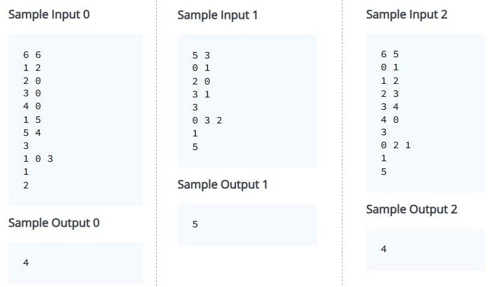

# Практикум 12: Алгоритъм на Дийкстра

- [Линк към темата за графи](../Pract%2011)

## Алгоритъм на Дийкстра

Алгоритъмът на Дийкстра намира най-краткия път от даден връх до всички останали ( *single-source to all* ). Може да се прилага както върху насочени графи, така и върху ненасочени. 

#### ❕**ВАЖНО**❕
> Теглата на ребрата не могат да бъдат отрицателни.

> #### Алгоритъм:
> 1) Задаваме пътя до началния връх да бъде 0, а до всички останали върхове -> +безкрайност
> 2) Пазим реда на обработка на върховете в приоритетна опашка, която е сортирана във възходящ ред спрямо разстоянието до началния връх
> 3) Добавяме началния връх в опашката
> 4) Докато в опашката има елементи:
>   - взимаме върха от top() на приоритетната опашка и pop()
>   - ако вече е маркиран като посетен - continue. Ако не е, то го маркираме като посетен
>   - обхождаме съседните му върхове и за тези от тях, които не са посетени:
>       - изчисляваме новото разстояние до съответния съсед
>       - проверяваме дали новото разстояние е по-оптимално и ако да, то го задаваме като най-оптимален път до съответния връх
>       - ако сме намерили по-оптимален път до съответния съсед, го добавяме в приоритетната опашка

#### Пример: 


#### Сложност:  **Θ((N + M) * log(N))**


## Задачи:
- [Линк към задачите](https://leetcode.com/problem-list/2htah0qh/)
- [Линк към допълнителни задачи](https://leetcode.com/problem-list/2hkcubyg/)

## Задачи от допълнителното упражнение:

### Задача 1: 

#### Условие: 


#### Решение: 
```c++
#include <cmath>
#include <cstdio>
#include <vector>
#include <iostream>
#include <algorithm>
using namespace std;


void dfs(int node, vector<bool>& visited, vector<vector<int>>& adjList)
{
    visited[node] = true;
    
    for(int neighbour : adjList[node])
    {
        if(!visited[neighbour])
        {
            dfs(neighbour, visited, adjList);
        }
    }
}

int main() {
    int T;
    cin >> T;
    
    vector<int> results(T);
    for(int i = 0; i < T; i++)
    {
        int V, E;
        cin >> V >> E;
        
        vector<vector<int>> adjList(V);
        
        for(int j = 0; j < E; j++)
        {
            int x, y;
            cin >> x >> y;
            
            adjList[x].push_back(y);
            adjList[y].push_back(x);
        }
        
        vector<bool> visited(V, false);
        
        int componentsCount = 0;
        for(int j = 0; j < V; j++)
        {
            if(!visited[j])
            {
                dfs(j, visited, adjList);
                componentsCount++;
            }
        }
        
        results[i] = componentsCount;
     }
    
    for(int i = 0; i < T; i++)
    {
        cout << results[i] << " ";
    }
    cout << endl;
    
        
    return 0;
}
```

</br>

### Задача 2: 

#### Условие: 


#### Решение: 
```c++
#include <cmath>
#include <cstdio>
#include <vector>
#include <iostream>
#include <algorithm>
#include <queue>
#include <unordered_map>
using namespace std;

int getPathLengthIfExisting(vector<unordered_map<int, int>>& adjList, queue<int>& path)
{
    
    int node = path.front();
    path.pop();
    
    int pathLength = 0;
    while(!path.empty())
    {
        int neighbour = path.front();
        path.pop();
        
        if(adjList[node].find(neighbour) != adjList[node].end())
        {
            pathLength += adjList[node][neighbour];
            node = neighbour;
        }
        else
        {
            return -1;
        }
    }
    
    return pathLength;
}

int main() {
    int V, E;
    cin >> V >> E;
    
    vector<unordered_map<int, int>> adjList(V);
    
    for(int i = 0; i < E; i++)
    {
        int x, y, w;
        cin >> x >> y >> w;
        
        if(adjList[x].find(y) == adjList[x].end())
        {
            adjList[x].insert({y, w});
        }
        else
        {
            adjList[x][y] = min(adjList[x][y], w);
        }
        
        if(adjList[y].find(x) == adjList[y].end())
        {
            adjList[y].insert({x, w});
        }
        else
        {
            adjList[y][x] = min(adjList[y][x], w);
        }
    }
    
    int K;
    cin >> K;
    
    queue<int> q;
    for(int i = 0; i < K; i++)
    {
        int x;
        cin >> x;
        
        q.push(x);
    }
    
    cout << getPathLengthIfExisting(adjList, q) << endl;
    
    return 0;
}
```

</br>

### Задача 3: 

#### Условие: 




#### Решение: 
```c++
#include <iostream>
#include <vector>
#include <unordered_set>
#include <queue>

typedef std::vector<std::vector<int>> Graph;

void readGraph(Graph& graph, int edges)
{
	while (edges--)
	{
		int from;
		int to;

		std::cin >> from >> to;

		graph[from].push_back(to);
		graph[to].push_back(from);
	}
}

std::vector<int> readPath()
{
	std::vector<int> path;

	int pathSize;
	std::cin >> pathSize;

	while (pathSize--)
	{
		int currentNode;
		std::cin >> currentNode;

		path.push_back(currentNode);
	}

	return path;
}

std::unordered_set<int> readForbiddenNodes()
{
	std::unordered_set<int> forbiddenNodes;

	int forbiddenNodesCount;
	std::cin >> forbiddenNodesCount;

	while (forbiddenNodesCount--)
	{
		int forbiddenNode;
		std::cin >> forbiddenNode;

		forbiddenNodes.insert(forbiddenNode);
	}

	return forbiddenNodes;
}

struct Pair
{
	int node;
	int distanceToNode;

	bool operator<(const Pair& other) const
	{
		return distanceToNode < other.distanceToNode;
	}
};

int dijkstra(int start, int end, Graph& graph,
	std::unordered_set<int>& forbiddenNodes, std::unordered_set<int>& pathNodes)

{
	pathNodes.erase(start);

	std::vector<int> distanceTo(graph.size(), INT32_MAX);

	std::priority_queue<Pair> pq;

	pq.push({ start, 0 });

	while (!pq.empty())
	{
		auto pair = pq.top();
		pq.pop();

		int node = pair.node;

		for (auto neighbor : graph[node])
		{
			int newDistance = pair.distanceToNode + 1;

			if (neighbor == end)
			{
				if (newDistance < distanceTo[neighbor])
				{
					distanceTo[neighbor] = newDistance;
				}

				break;
				// continue;
			}

			if (!forbiddenNodes.count(neighbor) && !pathNodes.count(neighbor))
			{
				if (newDistance < distanceTo[neighbor])
				{
					distanceTo[neighbor] = newDistance;
					pq.push({ neighbor, newDistance });
				}
			}
		}
	}

	return distanceTo[end];
}

struct A
{
	int a;
	int b;

	bool operator<(const A& other) const // !!!!!!! const
	{
		return a < other.a;
	}
};

struct B
{
	int a;
	int b;
};

struct Comparator
{
	std::vector<int> vector;

	bool operator()(const B& lhs, const B& rhs)
	{
		int value1 = vector[lhs.a];
		int value2 = vector[rhs.a];

		return value1 < value2;
	}
};

//int main()
//{
//	std::priority_queue<A> pq1;
//
//	Comparator comparator;
//	comparator.vector = { 1,2,3,4,5, };
//
//	std::priority_queue<B, std::vector<B>, Comparator> pq2(comparator);
//}

int main()
{
	int nodes;
	int edges;

	std::cin >> nodes >> edges;

	Graph graph(nodes);

	readGraph(graph, edges);

	std::vector<int> path = readPath();

	std::unordered_set<int> forbiddenNodes = readForbiddenNodes();
	std::unordered_set<int> pathNodes(path.begin(), path.end());

	std::vector<int> distanceTo(nodes, 0);

	for (int i = 0; i < path.size() - 1; i++)
	{
		int startNode = path[i];
		int endNode = path[i + 1];

		int dijkstraDistance = dijkstra(startNode, endNode, graph, forbiddenNodes, pathNodes);

		distanceTo[endNode] = (distanceTo[startNode] + dijkstraDistance);
	}

	std::cout << distanceTo[path.back()];
}
```